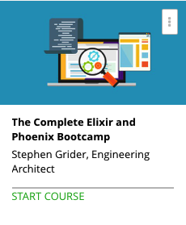

```
Roberto Nogueira  
BSd EE, MSd CE
Solution Integrator Experienced - Certified by Ericsson
```
# The Complete Elixir and Phoenix Bootcamp



**About This Course**

Master Functional Programming techniques while learning to build compelling web applications!

[Homepage](https://www.udemy.com/the-complete-elixir-and-phoenix-bootcamp-and-tutorial/learn/v4/overview)

## Topics
```
Section: 1
0 / 15
An Elixir Warmup
[x] 1. How to Get Help 2:52
[x] 2. Installing Elixir 2:00
[x] 3. Project Outline 4:05
[x] 4. Generating a Project 2:51
[x] 5. Elixir Modules and Methods 6:04
[x] 6. Lists and Strings 3:22
[x] 7. Object Oriented vs Functional Programming 9:12
[x] 8. Method Arguments 4:48
[x] 9. The Enum Module 5:54
[x] 10. Immutability in Elixir 3:57
[x] 11. Searching a List 6:02
[x] 12. Comprehensions Over Lists 7:11
[x] 13. Not Everything Works the First Time 5:02
[x] 14. Solving Nested Arrays 6:47
[x] 15. Importance of Index with Tuples 8:34


Section: 2
0 / 8
Elixir's Amazing Pattern Matching
[x] 16. Pattern Matching 10:43
[x] 17. Elixir's Relationship with Erlang 5:15
[x] 18. Saving a Deck 3:52
[x] 19. Pattern Matching Continued 10:23
[x] 20. Pattern Matching in Case Statements 14:14
[x] 21. The Pipe Operator 4:23
[x] 22. The Pipe Operator Continued 4:05
[x] 23. Module Documentation 3:49

Section: 3
0 / 6
Testing and Documentation
[x] 24. Writing and Generating Documentation 3:34
[x] 25. Creating Function Docs 6:18
[x] 26. Introduction to Testing 2:53
[x] 27. Amazingly Productive Doctests 3:37
[x] 28. Writing Effective Doctests 5:16
[x] 29. Case Tests 6:52

Section: 4
0 / 3
A Few Side Topics
[x] 30. Introduction to Maps 4:07
[x] 31. Updating Values in a Map 7:55
[x] 32. Keyword Lists 8:21

Section: 5
0 / 6
Image Manipulation with Elixir
[x] 33. Project Overview 3:43
[x] 34. Identicon Generation Process 2:33
[x] 35. Identicon Generation Process Continued 3:02
[x] 36. The Main Pipeline 3:20
[x] 37. Hashing a String 4:05
[x] 38. The Purpose of the Hex List 5:46

Section: 6
0 / 11
Structs - Elixir's Data Modeling Tool
[x] 39. Modeling Data with Structs 6:46
[x] 40. Pattern Matching Structs 10:39
[x] 41. Updating Structs 10:08
[x] 42. Building the Grid 8:16
[x] 43. Mirroring a Row 5:08
[x] 44. Mapping with Custom Functions 6:32
[x] 45. Grid Structure 8:31
[x] 46. Giving an Identicon Shape 9:34
[x] 47. Planning Image Creation 7:41
[x] 48. Creating the Pixel Map 5:48
[x] 49. Drawing Rectangles 9:46

Section: 7
0 / 7
On to Phoenix
[x] 50. Phoenix Installation 4:10
[x] 51. Postgres Setup on OSX 6:37
[x] 52. What is Phoenix? 6:34
[x] 53. App Overview 7:17
[x] 54. Into Phoenix We Go 8:09
[x] 55. Server Side Templating 3:39
[x] 56. Templates vs Layouts 9:30

Section: 8
0 / 12
MVC in Phoenix
[x] 57. Phoenix's MVC Model 7:37
[x] 58. Exploring the Router and Controller 9:46
[x] 59. Views vs Templates 10:00
[x] 60. The Model Layer in Phoenix 8:28
[x] 61. Migration Files 5:28
[x] 62. A Game Plan for Creating Topics 9:45
[ ] 63. Routing to the Topic Controller 7:24
[ ] 64. Setting Up the Topic Controller 6:05
[ ] 65. Code Reuse with Import, Alias, and Use 9:16
[ ] 66. Phoenix's Code Sharing Model 8:09
[ ] 67. Phoenix's Conn Struct 8:24
[ ] 68. A Phoenix Approach to Forms 4:53

Section: 9
0 / 8
Models in Phoenix
[ ] 69. The Topic Model 3:54
[ ] 70. Model Changesets and Validations 12:06
[ ] 71. More on Changesets 8:27
[ ] 72. Generating Changesets for the Form 6:04
[ ] 73. New Topic Form 7:48
[ ] 74. Phoenix Template Syntax 10:02
[ ] 75. Handling Form Submissions 10:41
[ ] 76. A Quick Review and Breather 8:15

Section: 10
0 / 16
Working with Postgres
[ ] 77. Introduction to the Repo Module 11:58
[ ] 78. Handling Failed Form Submissions 4:27
[ ] 79. Styling with CSS in Phoenix 6:34
[ ] 80. Breaking Restful Conventions Safely 6:43
[ ] 81. Using the Repo Module for Queries 7:03
[ ] 82. Building Lists in EEX Templates 6:48
[ ] 83. Redirects in the Controller 8:17
[ ] 84. Generating Anchors with Link Tags 12:09
[ ] 85. Router Wildcards 7:57
[ ] 86. Setting up the Edit Form 9:37
[ ] 87. Defining the Update Route 6:47
[ ] 88. Editing a Topic 11:20
[ ] 89. Linking to the Edit Topic Form 6:24
[ ] 90. The Resources Helper 7:00
[ ] 91. Deleting a Topic 9:43
[ ] 92. Wrapping up TopicController 6:58

Section: 11
0 / 11
Handling Authentication with OAuth
[ ] 93. OAuth Overview 6:27
[ ] 94. OAuth Setup with Ueberauth 7:50
[ ] 95. Creating a Github OAuth App 9:52
[ ] 96. Defining OAuth Routes 11:57
[ ] 97. Receiving User Info From Github 9:41
[ ] 98. Users Migration 7:40
[ ] 99. Digesting the OAuth Response 7:00
[ ] 100. The User Changeset 8:02
[ ] 101. Creating New Users 7:48
[ ] 102. Our Auth Grand Plan 7:08
[ ] 103. Handling OAuth Success 7:29

Section: 12
0 / 13
Transforming Requests with Plugs
[ ] 104. Introduction to Plugs 12:44
[ ] 105. Using a Module Plug to Set the User 11:44
[ ] 106. Implementing Module Plugs 9:02
[ ] 107. Allowing Users to Signout 10:27
[ ] 108. Restricting Access of Users 5:48
[ ] 109. The Require Auth Plug 13:04
[ ] 110. Controller Scoped Plugs 4:23
[ ] 111. Associating Users with Topics 6:56
[ ] 112. Altering Existing Tables 2:27
[ ] 113. Playing Around with Associations 9:07
[ ] 114. Using the Build Assoc Function 8:35
[ ] 115. Finalizing the Association 3:03
[ ] 116. Checking the Topics Owner 12:10

Section: 13
0 / 6
Websockets in Phoenix
[ ] 117. Introduction to Websockets 4:17
[ ] 118. Showing Individual Topics 6:40
[ ] 119. Making the Comments Migration 3:51
[ ] 120. The Comments Model 3:45
[ ] 121. Overview of Channels in Phoenix 6:13
[ ] 122. More Coming Soon....
0:00
```
